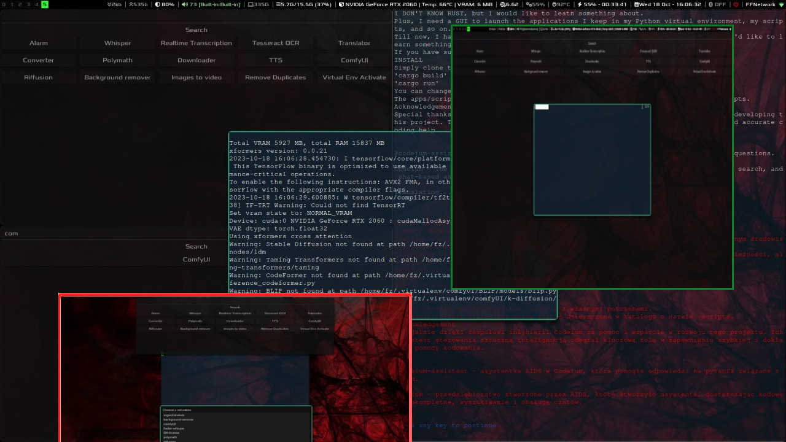
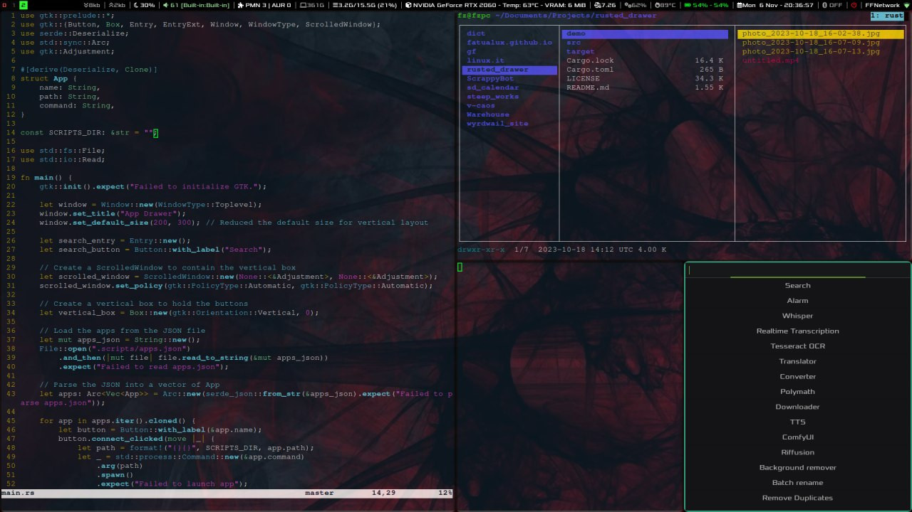
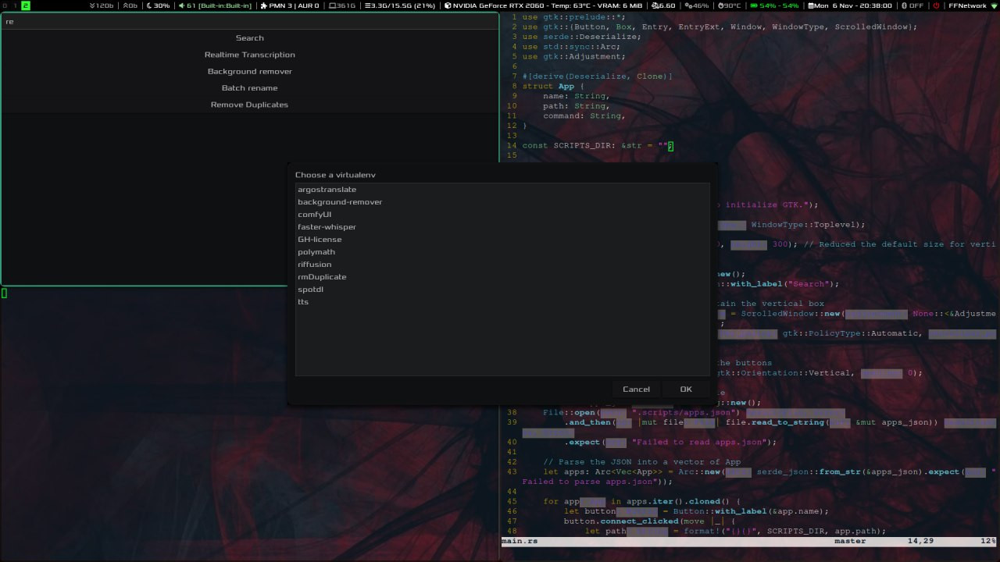
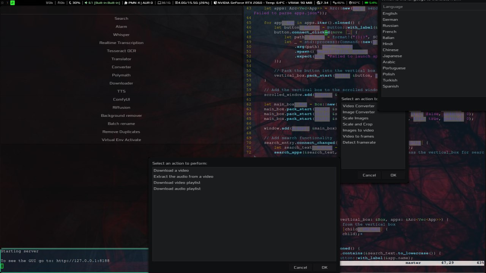

**RUSTED DRAWER**

I DON'T KNOW RUST, but I would like to leatn something about.

Plus, I need a GUI to launch the applications I keep in my Python virtual environment, my scripts, and so on.

Till now, I have been using a launcher I wrote, based on bash and zenity, but now I'd like to learn something else.

[

If you have suggestions or ideas, please let me know.

**INSTALL**

Simply clone this repository, then move into the directory and run:

'cargo build'
'cargo run'

You can change the file *apps.json*, according to your needs.

The apps/scripts thet the launcher starts must be placed in a directory named **.scripts**.

***Old version:***

***New version:***

 ***Acknowledgements***

Special thanks to the Codeium engineering team for their assistance and support in developing this project. Their AI-powered assistant has been instrumental in providing quick and accurate coding help.

- [@codeium-assistant](https://github.com/codeium-assistant) - The AI assistant from Codeium that helped answer code-related questions.
- [Codeium](https://codeium.com/) - The AI company that developed the assistant, providing code autocomplete, search, and chat-based assistance.

This project was also  made possible with the assistance of [GPT-3](https://openai.com/gpt-3) developed by OpenAI and its talented team of developers.
